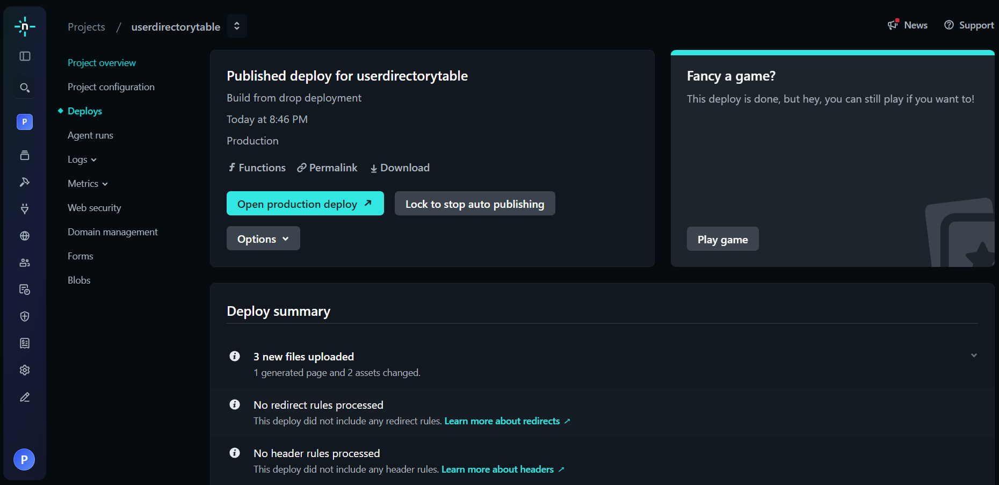
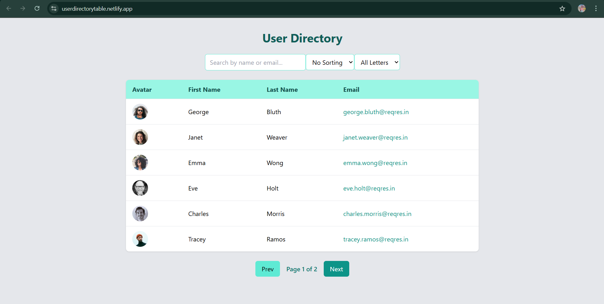

# User Directory – React + Tailwind + Axios

A fully responsive user directory application built with **React**, **Axios**, and **Tailwind CSS**, featuring:

* Live data fetching from API
* Search by name or email
* Filtering by first letter
* Sorting
* Pagination
* Loading spinner
* Fully mobile responsive UI
* Deployable on Netlify

## 🚀 Live Demo

https://userdirectorytable.netlify.app/


## 📌 Features

✔ Fetch users from a paginated API
✔ Search users by name or email
✔ Alphabetical filtering
✔ Sort by first name or email
✔ Loading spinner
✔ Clean UI design (Dark Teal theme)
✔ Fully responsive on all devices
✔ Easy to deploy on Netlify


## 🛠 Tech Stack

* **React.js**
* **Tailwind CSS**
* **Axios**
* **Reqres.in API**

---

## 📂 Folder Structure

src/
│── App.jsx
│── index.css
└── main.jsx

## 🔧 Installation & Setup

### 1️⃣ Clone the repository

git clone https://github.com/preeti558/SDE-Intern-Assingnment---YourDOST.git


### 2️⃣ Navigate into project

cd vite-project


### 3️⃣ Install dependencies

npm install


### 4️⃣ Start development server

npm run dev


## 🌐 API Used

All users are fetched from:

https://reqres.in/api/users

## 🚢 Deploying on Netlify

### Option 1: Automatic Deployment (Git)

1. Push your code to GitHub
2. Login to [https://netlify.com](https://netlify.com)
3. Click **New Site from Git**
4. Select your repository
5. Build command:

npm run build

6. Publish directory:

dist

### Option 2: Manual Deployment

1. Run:

npm run build

2. Upload the `dist` folder into Netlify Drag-and-Drop deploy

## 📷 Screenshots

 , 

## 🤝 Contributions

Pull requests are welcome!

For major changes, please open an issue first to discuss what you would like to improve.

---

## 📄 License

This project is open source and available under the MIT License.

--------------------------------------------------------------------------------------------------------------------------------------------------------------------------------------------------------------------
# 📝 To-Do CRUD API (Spring Boot)

A simple RESTful To-Do application built with **Spring Boot** that supports basic CRUD operations and stores data in a **local JSON file (no database required)**.
Ideal for beginners learning backend development, REST APIs, and deployment.

## 🚀 Features

* Create, Read, Update & Delete To-Do items
* Data stored locally in `todos.json`
* No database setup required
* Input validation handled in controller
* Supports `completed: true/false`
* Fully deployable to Render / Railway / Cyclic
* Clean JSON responses

## 📁 Project Structure

```
src/main/java/com/example/
 ├── Controller/
 │    └── TodoController.java
 ├── Service/
 │    └── TodoService.java
 ├── Model/
 │    └── TodoEntity.java
 └── TodoApplication.java
```


## 📌 REST API Endpoints

### ✔ 1. Get all todos

**GET /todos**

Response:

```json
[
  {
    "id": 1,
    "title": "Learn Spring Boot",
    "completed": false
  }
]
```

---

### ✔ 2. Create a new todo

**POST /todos**

Request body:

```json
{
  "title": "Buy milk",
  "completed": false
}
```


### ✔ 3. Update a todo

**PUT /todos/{id}**

Request body:

```json
{
  "title": "Buy milk and bread",
  "completed": true
}
```


### ✔ 4. Delete a todo

**DELETE /todos/{id}**

Response:

```
Todo deleted
```


## 💾 Data Storage

All todos are stored in:

```
/todos.json
```

Example JSON file:

```json
[
  {
    "id": 1,
    "title": "Learn Docker",
    "completed": false
  }
]
```

## 🐳 Docker Deployment

### 1️⃣ Build Docker Image

```bash
docker build -t todo-app .
```

### 2️⃣ Run Container

```bash
docker run -p 8080:8080 todo-app
```

The API is now available at:

```
http://localhost:8080/todos
```

## 🌐 Deploy to Render

### 1. Push the project to GitHub

### 2. On Render:

* Click **New → Web Service**
* Select your repository
* Set:

  * **Environment**: Docker
  * **Port**: 8080

### 3. Deploy

Render will automatically:

* Build Docker image
* Run the application
* Expose your API publicly

---

## 🧪 Testing

You can test using:

* Postman
* Thunder Client (VS Code)
* cURL
* Browser (for GET requests)

Example:

```bash
curl -X POST http://localhost:8080/todos \
-H "Content-Type: application/json" \
-d '{"title":"Learn Spring Boot", "completed":false}'
```

## ⚙ Tech Stack

* Java 17
* Spring Boot
* REST APIs
* JSON file storage
* Docker (optional)
* Render deployment


## 🙌 Author

**Preeti Verma**

This project was built for SDE Intern assignment - YourDost:

* REST API development
* JSON-based data persistence
* Spring Boot service/controller architecture
* Deployment with Docker and Render

---

## ⭐ Feedback

If you want enhancements like:

* Authentication
* Frontend integration
* Database support (MySQL/Postgres)

Feel free to reach out anytime.
-------------------------------------------------------------------------------------------------------------------------------------------------------------------------------------------------------------------
## DSA Problem: Given an array of integers, return the second largest UNIQUE number in the array. If it doesn’t exist, return -1.

## Approach:
1. Maintain two variables:
   - firstLargest
   - secondLargest
2. Traverse the array once:
   - If current number is greater than firstLargest:
       → Move firstLargest to secondLargest
       → Update firstLargest
   - Else if current number is not equal to firstLargest and greater than secondLargest:
       → Update secondLargest
3. Edge Cases:
   - Array has less than 2 numbers → return -1
   - No second unique largest number → return -1

Time Complexity:  O(n)
Space Complexity: O(1)

## Sample Input:
arr1 = [3, 5, 2, 5, 6, 6, 1]
arr2 = [7, 7, 7]

## Sample Output:
Second Largest element in arr1 is : 5
Second Largest element in arr2 is : -1
